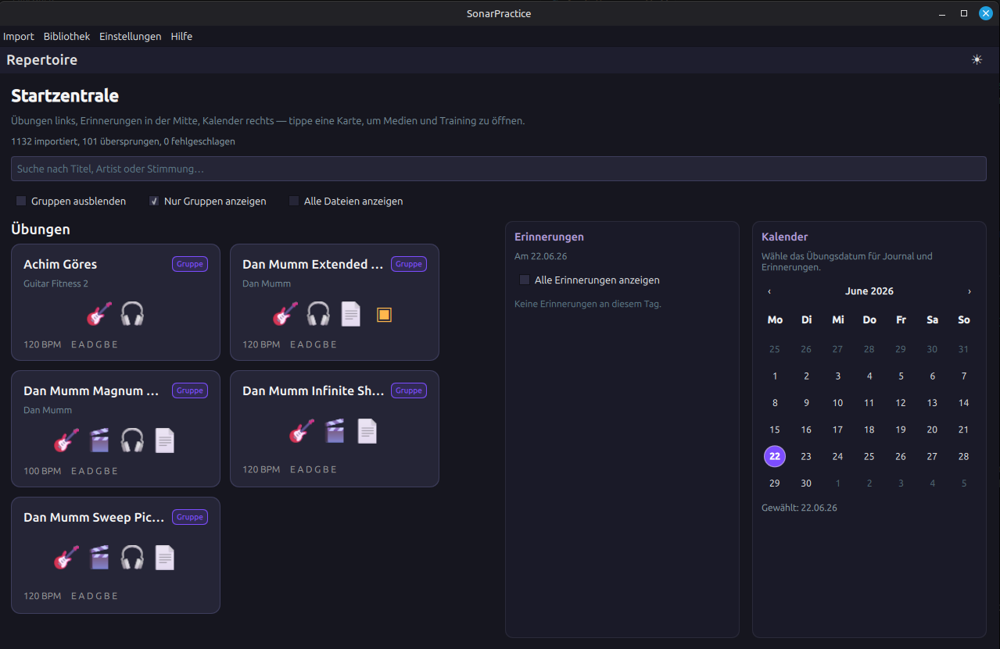
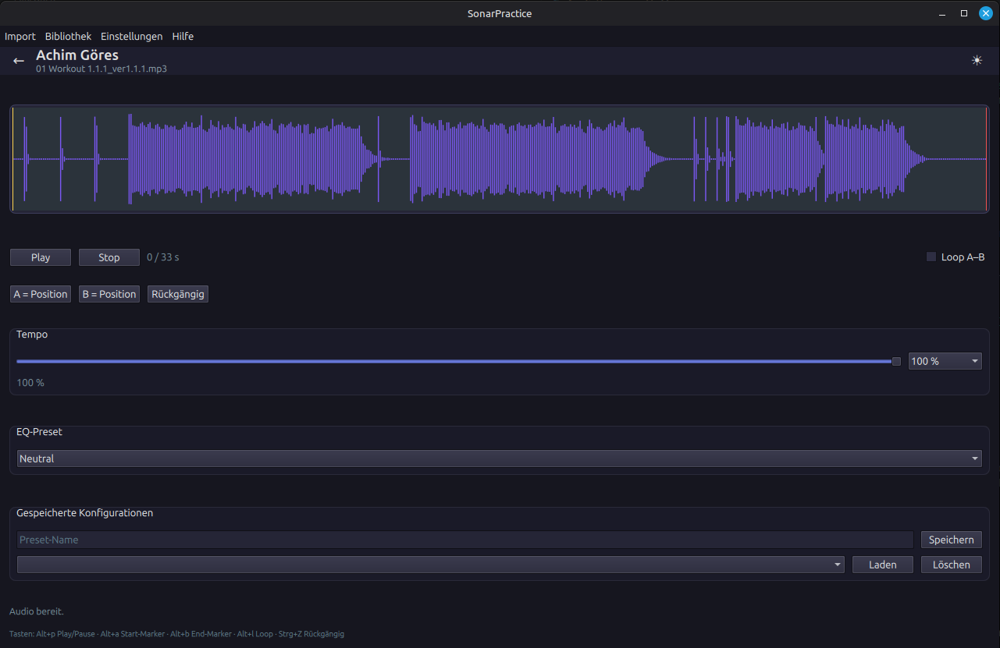

# SonarPractice

[](https://www.gnu.org/licenses/agpl-3.0.html)

SonarPractice is a personal passion project, created by a musician for musicians. It was developed to bring order to the chaos of digital practice sessions. Instead of constantly switching between file explorers, audio players, notation software, and various other resources, SonarPractice allows you to bundle all your learning material into intuitive practice groups.

## Key Features

**Centralized Management:** Link Guitar Pro files, PDFs, backing tracks, images, and videos into one logical unit. Everything you need for a song or lesson is just a single click away.

### Audio Toolkit:

- **Time-Stretching:** Slow down audio tracks without changing the pitch (powered by *RubberBand*).
- **Loop Function:** Define precise regions (A-B loops) for mastering difficult passages.

**Practice Journal & Notes:**

 Log your sessions using the built-in timer and keep track of thoughts or tips in the integrated Markdown notes field.

**Planning Tool:**

 Create an individual practice plan. The reminder feature will prompt you with your planned exercises as soon as you launch the application.

## Technical Requirements

SonarPractice is designed to be platform-independent and is built on a modern C++ stack. To compile the project, the following libraries are required:

- **Qt 6.8 or newer** (Core, Gui, Widgets). Recommended for local development: latest Qt from the [online installer](https://www.qt.io/download-qt-installer) (e.g. 6.11.x). **CI builds use Qt 6.8.3 LTS** via aqt — newer Qt versions are not reliably available there yet. The distro Qt on Linux Mint/Ubuntu (often 6.4.x) is too old to build this project.
- **RubberBand 4.0.0** (for precise time-stretching)
- **FFmpeg** (libavformat, libavutil for stream probing)

> So far, the project has been tested on Linux and Windows; macOS support is currently planned.

* **Arch Linux / Manjaro:**

You can install the required packages directly via `pacman`:

```bash 
  sudo pacman -S qt6-base rubberband ffmpeg pkgconf cmake ninja
```

* **Ubuntu / Debian / Linux Mint:**

It is recommended to use the official Qt Online Installer (Maintenance Tool) to install the latest version. The remaining system dependencies can be installed via apt:

```bash
sudo apt install librubberband-dev libvulkan-dev libavformat-dev libavutil-dev pkg-config
```

## Compiling

Once the dependencies are installed, you can build the project as follows:

Clone the repository
```bash
git clone https://github.com/sonar-project/SonarPractice
cd SonarPractice
```

## Acknowledgments & Credits

SonarPractice is built upon the excellent work of the open-source community. A big thank you goes to the developers and projects that made this tool possible:

Qt: For the powerful framework that enables cross-platform development.

RubberBand: For the world-class audio library that allows for high-quality time-stretching.

FFmpeg: For the essential tools for audio and video stream processing.

## License

SonarPractice is licensed under the GNU Affero General Public License v3.0. This ensures that the project's source code and any derivative works remain open and accessible to the community.

## Screenshots

### Launch Hub

Here you can see the central dashboard where your practice groups are organized.



### Audio Toolkit

The configuration view for audio files, allowing for precise control and practice management.



> *Screenshots show local user data for demonstration purposes.*
